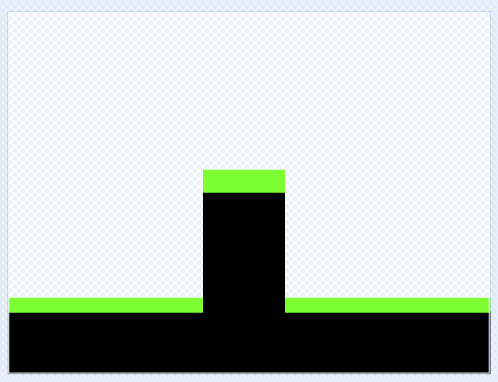
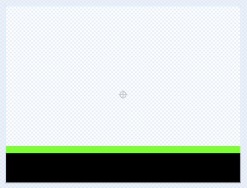
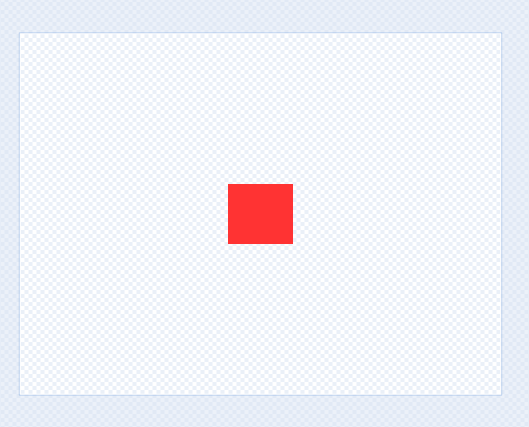

# Introduksjon {.intro}

Man skal starte med å være en firkantet figur som skal komme seg over hindre. 




# Steg 1: Lage bakken og figuren {.activity}

Vi tegner en figur selv og bakken som den beveger seg på. Du velger selv hvordan de skal se ut. Slett kattefiguren, og trykk på "tegn". Lag "bakke"

## Sjekkliste {.check}

- [ ] Gå inn på <link href="https://scratch.mit.edu">https://scratch.mit.edu</link>, og endre språk til "norsk".

- [ ] Start et nytt prosjekt.

- [ ] Slett kattefiguren. 

- [ ] Lag bakken ved å trykke på "tegn", og kall den "bakke".

- [ ] Lag figuren ved å trykke på "tegn", og kall den "figur". 

Her ser du en brun bakgrunn med grønt gress, men du velger selv farge og utseende.

  

Her ser du en figur som er en rød firkant. Det er viktig å sentrere figuren riktig for at den skal bevege seg på en naturlig måte senere.

  


# Steg 2: Lage kode for figuren {.activity}

Teksten nedenfor sørger for at du kan kontrollere figuren din ved å bruke piltastene. Det er et koordinatsystem i scratch hvor x er vertikal posisjon og y er horisontal posisjon. 
  ```blocks
  når grønt flagg klikkes
  gå til x: (-200) y: (0)
  gjenta for alltid
      hvis <tast (pil høyre v) trykket?>
        endre x med (3)
      slutt
      hvis <tast (pil venstre v) trykket?>
        endre x med (-3)
      slutt
      hvis <tast (pil opp v) trykket?>
        endre y med (10)
      slutt
  slutt
  ```
Hvis du tester denne koden, så vil du se at du har en figur som svever i løse lufta, og den kan ikke bevege seg nedover. Vi må legge til tyngdekraft, som gjør at den faller automatisk, men den må ikke falle gjennom bakken. Vi legger til en test på om den berører fargen til bakken. Bruk malebøtte-ikonet for å få eksakt den samme fargen som bakken har. 

<br>
&nbsp
<br>
&nbsp
<br>
&nbsp
<br>
&nbsp
<br>
&nbsp
<br>
&nbsp
<br>
&nbsp
<br>
&nbsp
<br>
&nbsp
<br>
&nbsp
<br>
&nbsp
<br>
&nbsp


  ```blocks 
  når grønt flagg klikkes
  gå til x: (-200) y: (0)
  gjenta for alltid
      hvis <tast (pil høyre v) trykket?>
        endre x med (3)
      slutt
      hvis <tast (pil venstre v) trykket?>
        endre x med (-3)
      slutt
      hvis <tast (pil opp v) trykket?>
        endre y med (10)
      slutt
      hvis <ikke <berører fargen (#00FF00)>>
        endre y med (-4)
      slutt
  slutt
  ```


## Test prosjektet {.flag}

__Klikk på det grønne flagget.__

- [ ] Kan du styre figuren med piltastene?

- [ ] Faller figuren mot bakken? 

- [ ] Stopper figuren når den treffer bakken? 

<br>
&nbsp;
<br>

# Steg 3: Lage hindringer {.activity}

*Nå ønsker vi at bakgrunnen skal endre seg gjennom spillet.*

## Sjekkliste {.check}

- [ ] Lag en ny drakt på bakken ved å klikke på "drakter". Du ser at du har en drakt som heter "drakt1". Høyreklikk på den, og klikk på "lag en kopi".
Denne kan du bygge ut, f.eks. med en hindring. Kall denne for "drakt2".

  
  
- [ ] Lag kode som gjør at når du kommer til enden av skjermen, så endres drakt til "drakt2". Spillet blir altså vanskeligere etter hvert. Legg til følgende kodesnutt inni "for alltid"-løkken over for å gi bakgrunnen beskjed om at den skal endre til drakt 2. 

  ```blocks 
  hvis <(x-posisjon) > (225)> 
    send melding (next level v)
    gå til x: (-200) y: (0)
  slutt
  ```
&nbsp;


- [ ] Legg inn følgende to kodeblokker under "bakke" for å sørge for at spillet alltid starter på nivå 1, og at vi skifter til nivå 2 når vi får beskjed om det.

  ```blocks 
  når jeg mottar [next level v]
  neste drakt 
  
  når grønt flagg klikkes
  bytt drakt til (drakt1 v)
  ```


- [ ] Test spillet ditt, og sjekk at du kan gå til nivå 2. Problemet nå er at figuren kan gå rett gjennom hindringen. For å forhindre dette, sørger vi for at figuren ikke får lov til å berøre det svarte.


- [ ] Bygg ut blokken 

  ```blocks
      hvis <tast (pil høyre v) trykket?>
        endre x med (3)
      slutt
  ```
  slik at den ser slik ut:
  ```blocks
      hvis <tast (pil høyre v) trykket?> 
        endre x med (3)
        hvis <berører fargen (#000000)?>
          endre x med (-3)
        slutt
      slutt
  ```
- [ ] Gjør tilsvarende med "pil venstre. 


## Test prosjektet {.flag}

__Klikk på det grønne flagget.__

- [ ] Sjekk at figuren spretter tilbake når den treffer det svarte, både fra den ene og den andre siden. 


# Steg 4: Gjør bevegelsen mer realistisk {.activity}

*Vi vil at man bare skal kunne hoppe når man står på bakken, man skal ikke fly kunne fly.*

## Sjekkliste {.check}

- [ ] Vi legger på en "hvis berører bakke" utenpå "hvis pil opp trykket": 

  ```blocks
  hvis <berører (bakke v)?
    hvis <tast (pil opp v) trykket?>
      gjenta (10) ganger
        endre y med (10)
      slutt
    slutt
  slutt 
  ```
- [ ] Hvis det er umulig å hoppe over hindringen, gjør en av tallene større enn 10. 
- [ ] Lag flere nivåer og flere hindringer selv!
