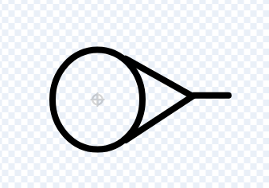

# Introduksjon {.intro}

Vi styrer et skytevåpen, som vi skyter zoombier med. Dette er en forenklet versjon av et spill vi har funnet tutorial for på youtube. 

<link href="https://www.youtube.com/watch?v=QXru0rSV2ZQ">https://www.youtube.com/watch?v=QXru0rSV2ZQ</link>


# Steg 1: Lage skyteren {.activity}

Vi tegner en figur selv. Slett kattefiguren, og trykk på "tegn".

 

## Sjekkliste {.check}
- [ ] Gå til <link href="https://scratch.mit.edu">https://scratch.mit.edu</link>

- [ ] Start et nytt prosjekt og slett kattefiguren.

- [ ] Lag skytevåpenet ved å trykke "tegn", tegn den og kall den "shooter".

- [ ] Lag følgende kode for shooter: 

  ```blocks
  når grønt flagg klikkes
    gå til x: (30) y: (30)
    pek i retning (90)
  gjenta for alltid
    hvis <tast (pil høyre v) trykket?>
      snu @turnRight (5) grader
    slutt
    hvis <tast (pil venstre v) trykket?>
      snu @turnLeft (5) grader
    slutt
    hvis <tast (pil opp v) trykket?>
      gå (3) steg
    slutt
  slutt
  ```
- [ ] Trykk, på det grønne flagget og sjekk at du kan rotere skytevåpenet og gå framover
&nbsp;<br>&nbsp;<br>
# Steg 2: Lage kula {.activity}

## Sjekkliste {.check}
- [ ] Lag kula ved å trykke "tegn", tegn den og kall den "kule".

 
  
- [ ] Lag kode for kula: 

  ```blocks
  når grønt flagg klikkes
    skjul
    gjenta for alltid
      gå til (shooter)
      pek i retning ([retning v] av (shooter v))
    slutt
  ```
Denne koden sørger for at kula alltid starter i skytevåpenet og går i samme retning som skytevåpenet peker.
Du kan prøve uten "skjul" for å se at kula er på riktig sted, men vi ønsker ikke å vise en kule midt i pistolen når vi spiller spillet. 
 
- [ ] Lag følgende kodeblokk, fortsatt for kula. 

  ```blocks
  når [mellomrom v] trykkes
  lag klon av (meg v)
  ```
&nbsp;
<br>
&nbsp;
<br>

- [ ] Vi må si noe om hva som skjer når vi starter en ny klon

   ```blocks
  når jeg starter som klon
  vis 
  gjenta til <berører (kant v)?>
   gå (10) steg
  slutt
  slett denne klonen
  ```


# Steg 3: Lage zoombier {.activity}

Vi skal lage zoombier som vi kan skyte på, og så gjelder det å ikke la dem ta oss. 

## Sjekkliste {.check}

 

- [ ] Lag en ny figur med tegneprogrammet. Den kan se ut som den over (du ser den har to armer som stikker fram). Hvis du er flink til å tegne, klarer du kanskje å lage noe mer realistisk. &nbsp;<br>&nbsp;<br>&nbsp;<br>&nbsp;<br>&nbsp;<br>&nbsp;

- [ ] Lag kode for zoombien:


   ```blocks
  når grønt flagg klikkes
  skjul
  gjenta for alltid
    vent (1) sekunder
    lag klon av [meg v]
  slutt

  når jeg starter som klon
  sett x til (250)
  sett y til (tilfeldig tall fra (-170) til (170))
  vis 
  gjenta til <berører [shooter v]?>
    pek mot (shooter v)
    gå (2) steg
  slutt
  stopp [alle v]
  ```
- [ ] Sjekk at zoombier lages og at de beveger seg

# Steg 4: Drepe zoombiene
Zoombiene dør når kulene treffer dem. 

- [ ] Sjekk at alle objekter har fornuftig størrelse og at de starter på riktig sted. Hvis ikke, gjør noen justeringer. Er f.eks. zoombiene for små eller kulene for store? Bør skyteren starte lenger til venstre når spillet starter? Går zoombiene for fort? Er det for mange av dem? 

- [ ] Sørg for at vi kan drepe zoombier. Legg inn følgende inni "gjenta til berører shooter".

   ```blocks  
  hvis <berører (kule v)?>
    slett denne klonen
  slutt
  ```

- [ ] Zoombiene trenger ikke dø når de treffes av kuler. De kan ha flere liv, og så kan de miste liv hver gang de blir truffet. Men da må du ha en variabel som heter "liv". Og du kan ha flere zoombier, noen sterkere enn andre. Men det kan vi prøve på en annen dag. 
